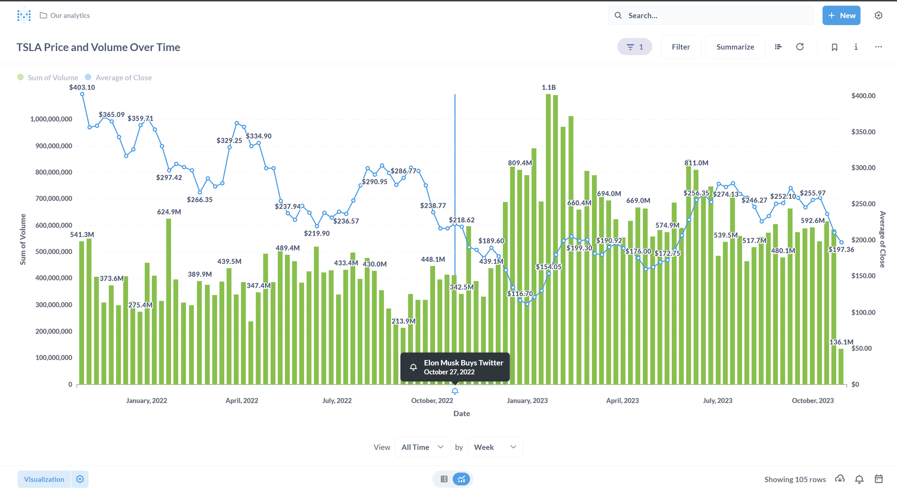

# Overview

This repo is a playground to learn how to use Metabase. Using dlt to load data from a pandas DataFrame into DuckDB. The DataFrame comes from `yfinance` which can retrieve historical stock data for whatever symbol(s) you provide it.

# Results

I created some sample visualizes which Metabase calls *Metabase* calls *Questions*. I really like this phrasing because every visualize should be trying to answer some question. You can add these questions to a dashboard along with other things like text, link cards etc.

Some features I really enjoyed 
- ***X-Rays***: Metabase will generate automatically generate dashboards and graphs from your data or other graphs as you drill into them. One of the most common things someone does when looking at a dashboard is wanted to drill down into certain parts to see what's is driving this trend. Metabase makes this really easy to do.
- ***Events***: Being able to add events to your graphs is super helpful to see how they may have impacted the data. For example I looked at `TSLA` stock price and volume after Elon bought twitter. Correlation doesn't equal causation but it may provide some helpful context as to what was going on during that time period.

